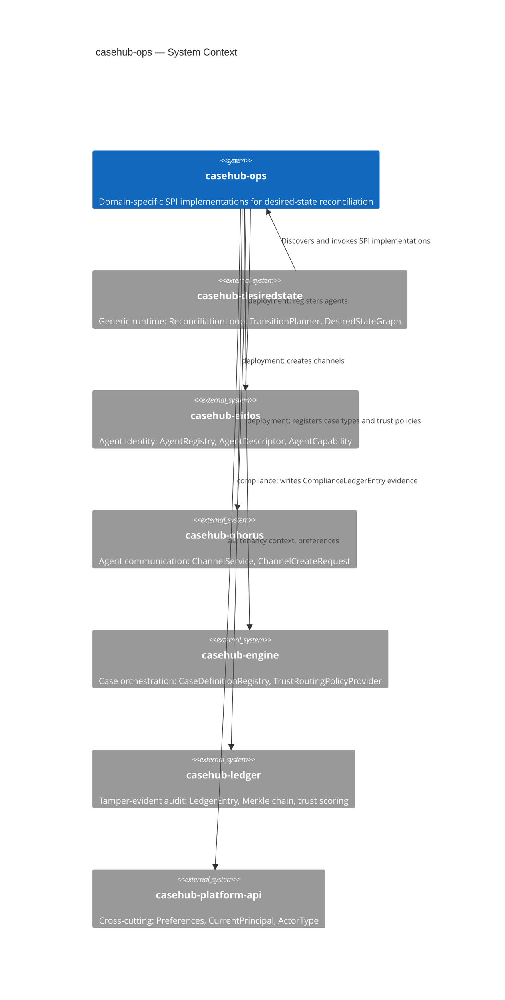
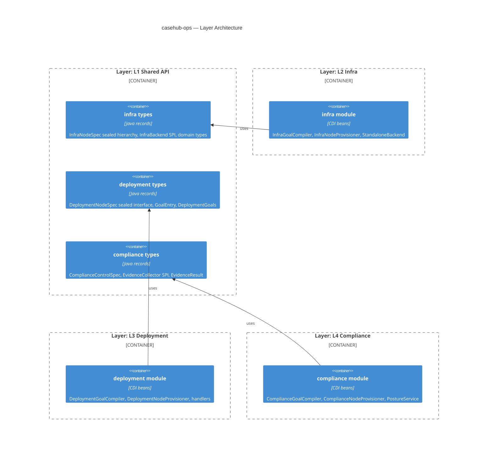
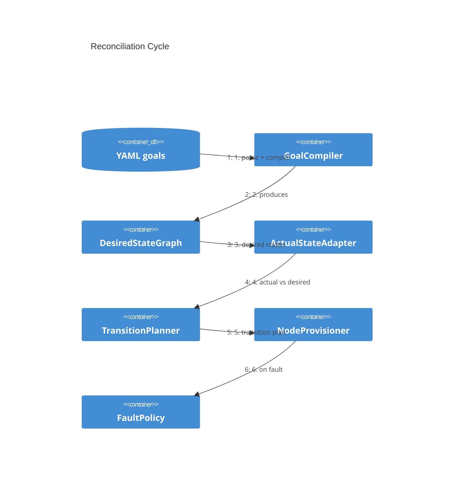
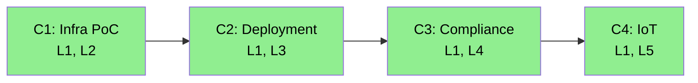

# CaseHub Ops — ARC42STORIES.MD

**Spec:** Arc42Stories v0.1
**Profile:** CaseHub — Integration tier
**Profile ref:** `../parent/docs/arc42stories-casehub-profile.md` · fallback: `https://raw.githubusercontent.com/casehubio/parent/main/docs/arc42stories-casehub-profile.md`
**Build position:** Integration — depends on `casehub-desiredstate-api` (runtime SPIs), plus domain-specific foundation APIs per module
**Consumed by:** Any CaseHub application needing desired-state management for a specific operational domain
**Depends on:** `casehub-desiredstate-api`, `casehub-eidos-api`, `casehub-qhorus-api`, `casehub-engine-api`, `casehub-ledger-api`, `casehub-platform-api`

---

## §1 Introduction and Goals

### Description

CaseHub Ops provides domain-specific implementations of the `casehub-desiredstate` generic runtime SPIs. Each module implements GoalCompiler, ActualStateAdapter, NodeProvisioner, FaultPolicy, and EventSource for one operational domain. Modules are standalone Jandex libraries — drop one on the classpath, and desired-state reconciliation activates for that domain with zero configuration.

Four domains: infrastructure provisioning (Terraform/Ansible augmentation), CaseHub agent topology (deployment), continuous compliance posture (SOC2/GDPR/EU-AI-Act/DORA/NIS2/ISO27001), and IoT device management.

### Stakeholders

| Stakeholder | Interest |
|---|---|
| Platform team | Validates the desiredstate generic runtime against real domains |
| Compliance officer | Continuous posture visibility — "are we SOC2 compliant right now?" |
| DevOps engineer | Declarative topology and infrastructure with governance, audit, self-healing |
| IoT integrator | Physical + logical device provisioning with trust-weighted execution |

### Quality Goals

| Priority | Goal | Scenario |
|---|---|---|
| 1 | SPI correctness | Each module's GoalCompiler, ActualStateAdapter, NodeProvisioner, FaultPolicy, and EventSource satisfy the desiredstate runtime contracts |
| 2 | Domain isolation | Each module compiles and tests independently — no cross-module dependencies at runtime |
| 3 | Zero-config activation | Adding a module JAR to the classpath activates reconciliation with no application.properties changes |

### Artifact Schema

| Artifact type | Format | Example | Where it lives |
|---|---|---|---|
| Issue | `#NNN` or `casehubio/casehub-ops#NNN` | `#9` | GitHub Issues |
| Garden entry | `GE-YYYYMMDD-XXXXXX` | `GE-20260601-85afd0` | `~/.hortora/garden/` |
| Design spec | `YYYY-MM-DD-topic-design` | `2026-06-18-compliance-posture-domain-design` | `docs/superpowers/specs/` |
| Blog entry | `YYYY-MM-DD-[initials]NN-title` | `2026-06-18-mdp01-compliance-posture-desired-state` | workspace `blog/` |

---

## §2 Constraints

### Platform

| Constraint | Value |
|---|---|
| Java | 21 |
| Build | `mvn --batch-mode install` |
| Module type | Jandex library — no Quarkus extension, no deployment module |
| Activation | Classpath presence triggers CDI discovery |

### Architectural Constraints

- Single-domain deployment: one domain module per classpath. Multiple domain modules create CDI ambiguity (`@ApplicationScoped` GoalCompiler, ActualStateAdapter, etc. with no qualifiers). Each operational application deploys with exactly one domain module.
- `api/` carries shared types across all domains. Domain-specific types live in the domain's api package (`io.casehub.ops.api.deployment`, `io.casehub.ops.api.infra`, `io.casehub.ops.api.compliance`).
- `testing/` is test-scope only — never compile or runtime.
- Human nodes generate casehub-work WorkItems, never blocking provisioner calls.
- tenancyId propagated through all calls — bind in repository/adapter layer only.

---

## §3 Context and Scope

### Boundary Rules

What casehub-ops does NOT do:

- Run the reconciliation loop — `casehub-desiredstate` owns that
- Store persistent state — domain modules use in-memory stores or delegate to foundation modules
- Expose REST APIs — domain modules are injectable CDI beans, not endpoints
- Define the generic SPI contracts — `casehub-desiredstate-api` owns GoalCompiler, NodeProvisioner, etc.

---

## §4 Solution Strategy

### Core Pattern: SPI Quad

Every domain module implements the same five SPIs from `casehub-desiredstate-api`:

| SPI | Responsibility |
|---|---|
| `GoalCompiler<G>` | YAML declaration → `DesiredStateGraph` |
| `ActualStateAdapter` | Query actual state, return `NodeStatus` per node |
| `NodeProvisioner` | Make desired state real — create, update, or remove |
| `FaultPolicy` | React to faults with graph mutations |
| `EventSource` | Hot `Multi<StateEvent>` stream for drift signals |

Each domain maps its own domain model onto these five SPIs. The runtime handles the reconciliation loop, transition planning, and fault dispatch.

### Layer Taxonomy

| Layer | What it adds |
|---|---|
| L1 Shared API | Cross-domain types in `casehub-ops-api` — used by multiple domain modules |
| L2 Infra domain | Infrastructure provisioning — Terraform/Ansible augmentation, InfraBackend SPI |
| L3 Deployment domain | CaseHub agent topology — agents, channels, case types, trust policies |
| L4 Compliance domain | Continuous compliance posture — evidence-based drift, framework scoring |
| L5 IoT domain | Physical + logical device provisioning |

### Chapter Sequencing Rationale

- C1 (Infra) before C2 (Deployment): C1 validates the generic runtime SPIs against a universally understood domain. C2 builds on lessons learned.
- C2 (Deployment) before C3 (Compliance): C2 establishes the flat-graph pattern (no backend abstraction) and sealed type dispatch. C3 uses a different pattern (generic control spec with discriminator) — having both in the codebase demonstrates when each is appropriate.
- C3 (Compliance) before C4 (IoT): C3 introduces ledger integration (ComplianceLedgerEntry). C4 builds on casehub-iot foundation which is independently developed.

### Type Strategy Selection

Three type strategies emerged across the domain modules, each fitting a different structural situation:

| Strategy | When | Example |
|---|---|---|
| Sealed hierarchy | Variants have different fields and provisioning semantics | `IoTNodeSpec` → `PhysicalDeviceSpec` (label, human-provisioned) vs `DeviceConfigSpec` (capabilities map, auto-provisioned) |
| Sealed with wrapper | Backend routing metadata needed alongside domain spec | `InfraDesiredNodeSpec` wraps `InfraNodeSpec` + `backendId` |
| Generic record with discriminator | Variants differ in configuration, not shape | `ComplianceControlSpec` with `controlType` discriminator |

The IoT domain confirmed this taxonomy: PhysicalDeviceSpec and DeviceConfigSpec have genuinely different provisioning semantics (human vs automated) and different fields — a structural difference requiring sealed hierarchy without wrapper.

---

## §5 Building Block View

### Module Structure

| Module | Artifact | Package root | Purpose |
|---|---|---|---|
| `api/` | `casehub-ops-api` | `io.casehub.ops.api` | Shared types across all domains |
| `infra/` | `casehub-ops-infra` | `io.casehub.ops.infra` | Infrastructure provisioning — PoC |
| `deployment/` | `casehub-ops-deployment` | `io.casehub.ops.deployment` | CaseHub agent topology — primary |
| `compliance/` | `casehub-ops-compliance` | `io.casehub.ops.compliance` | Compliance posture — largest market gap |
| `iot/` | `casehub-ops-iot` | `io.casehub.ops.iot` | IoT desired state |
| `testing/` | `casehub-ops-testing` | `io.casehub.ops.testing` | Shared test fixtures (test scope only) |

---

## §6 Runtime View

### Reconciliation Cycle (all domains)

The runtime owns the loop. Each domain module provides the five SPI implementations. The cycle repeats on a configurable interval or in response to events from the domain's `EventSource`.

---

## §7 Deployment View

Each domain module is a Jandex-indexed JAR. No Quarkus extension descriptor, no deployment module, no build-time processing. CDI discovers `@ApplicationScoped` beans at startup.

| Deployment unit | Activation | Runtime dependency |
|---|---|---|
| `casehub-ops-infra.jar` | Classpath presence | `casehub-desiredstate`, `casehub-platform-api` |
| `casehub-ops-deployment.jar` | Classpath presence | `casehub-desiredstate`, `casehub-eidos`, `casehub-qhorus`, `casehub-engine` |
| `casehub-ops-compliance.jar` | Classpath presence | `casehub-desiredstate`, `casehub-ledger` |
| `casehub-ops-iot.jar` | Classpath presence | `casehub-desiredstate`, `casehub-iot` |

---

## §8 Crosscutting Concepts

### SPI Quad Pattern

Every domain implements the same five SPIs. The pattern:
1. Define domain types in `api/` (node specs, goal records)
2. Implement `GoalCompiler` — YAML → `DesiredStateGraph` with domain-typed `NodeSpec` instances
3. Implement `ActualStateAdapter` — query actual state from foundation APIs or internal stores
4. Implement `NodeProvisioner` — dispatch by node type, delegate to handlers or backends
5. Implement `FaultPolicy` — return `List.of()` unless graph mutations are needed
6. Implement `EventSource` — hot `Multi<StateEvent>` with `emit()` for external callers

### YAML Goal Loading

Each domain defines a goal loader (e.g. `DeploymentGoalLoader`, `ComplianceGoalLoader`). The pattern: classpath-first resource lookup, filesystem fallback, directory-based merging of multiple YAML files into one goals record.

### Spec Hash Drift Detection

Both deployment and compliance modules use an in-memory `ConcurrentHashMap<NodeId, Integer>` to detect when a node's desired spec changes between reconciliation cycles. If the spec hash differs from the last provisioned hash, the node is reported as `DRIFTED` even if the actual state matches the old spec. This forces re-provisioning with the updated declaration.

### Capability Normalization Across Type Boundaries

Comparing desired state (YAML-parsed) against actual state (IoT API) requires normalizing both sides to a common representation. The critical boundary: YAML parses `22` as `Integer`, the IoT `Temperature` type uses `BigDecimal`, and `BigDecimal.equals()` is scale-sensitive (`22.0 ≠ 22`).

Normalization rules:
- All numeric types → `BigDecimal.stripTrailingZeros()` (scale-safe equality)
- `Temperature` → `Map.of("value", BigDecimal, "unit", String)` (both sides must normalize nested maps)
- `Enum<?>` → `name()` string
- `Map<String, Object>` → recursive normalization (the desired side has `Integer` inside nested temperature maps)
- Null values → filtered out (IoT devices include nullable capabilities for Optional fields like `brightness`)

The normalizer is stateless and applied on both sides of the comparison — `CapabilityNormalizer.normalize()` in `IoTActualStateAdapter` and `IoTNodeProvisioner`.

### Anti-patterns

**Symptom:** CDI ambiguity errors at startup — multiple beans of type `GoalCompiler`, `NodeProvisioner`, etc.
**Cause:** Two domain modules on the same classpath. Each provides `@ApplicationScoped` implementations of the same SPIs with no CDI qualifiers.
**Fix:** Deploy one domain module per application. A compliance application uses `casehub-ops-compliance.jar` only. A deployment application uses `casehub-ops-deployment.jar` only.

**Symptom:** Drift detected but node never re-provisioned — DRIFTED status appears in logs but no transition is planned.
**Cause:** `TransitionPlanner` in `casehub-desiredstate` previously had no code path for `DRIFTED` — it handled `ABSENT`/`UNKNOWN` → PROVISION and `PRESENT`-not-in-desired → DEPROVISION only.
**Fix:** Fixed in casehubio/casehub-desiredstate#38 — `TransitionPlanner.plan()` now treats DRIFTED like ABSENT (`case DRIFTED, ABSENT, UNKNOWN -> true` in the provision switch). Config drift self-healing works for all domain modules.

**Symptom:** `AgentCapability` constructor call fails with wrong argument count after eidos API update.
**Cause:** eidos added a new field (`excludedDomains`) to `AgentCapability`. Binary incompatibility — existing code compiles against old API but fails at runtime.
**Fix:** Update all `AgentCapability` constructor calls to include the new parameter. Pin to the eidos version that matches. This is the cost of using constructor calls on records across repo boundaries.

---

## §9 Journeys and Chapters

### §9.1 Journey Overview

| Journey | Description | Chapters | Status |
|---|---|---|---|
| Desired-state ops domains | Implement desired-state management for four operational domains, validating the generic runtime | 4 | ✅ Complete |

### §9.2 Chapter Index

| # | Chapter | Journey | Layers touched | Delta summary | Status |
|---|---|---|---|---|---|
| 1 | Infra PoC | Desired-state ops domains | L1, L2 | High, High | ✅ |
| 2 | Deployment domain | Desired-state ops domains | L1, L3 | Medium, High | ✅ |
| 3 | Compliance domain | Desired-state ops domains | L1, L4 | Medium, High | ✅ |
| 4 | IoT domain | Desired-state ops domains | L1, L5 | Low, High | ✅ |

**Layer × Chapter matrix**

| Layer | C1 | C2 | C3 | C4 |
|---|---|---|---|---|
| L1 Shared API | High | Medium | Medium | Low |
| L2 Infra | High | — | — | — |
| L3 Deployment | — | High | — | — |
| L4 Compliance | — | — | High | — |
| L5 IoT | — | — | — | High |

L1 receives contributions from every chapter. L2–L5 are each single-chapter layers — additive, domain-specific, no cross-layer churn.

**Sequencing rationale:**
- C1 before C2: C1 validates the desiredstate SPIs against a universally understood domain (infrastructure). Lessons learned (backend abstraction overhead, typed domain context, EventSource passivity) informed C2's simpler design.
- C2 before C3: C2 establishes sealed type dispatch and handler delegation. C3 demonstrates the alternative — generic spec with discriminator — showing when each pattern fits.
- C3 before C4: C3 introduces ledger integration. C4 builds on casehub-iot foundation (independently developed, on 0.2-SNAPSHOT).

### §9.3 Chapter Entries

### Chapter 1 — Infra PoC

**Journey:** Desired-state ops domains | **Sequence:** 1 of 4 | **Status:** ✅
**Delivered:** 2026-06-14 | **Issues:** #1, #5 | **Blog:** `2026-06-14-mdp01-infra-poc-three-layers.md`

**What this delivers**
The system can declare infrastructure resources (K8s namespaces, deployments, services, databases) as a desired-state graph, provision them through a pluggable backend SPI, detect drift, and evaluate fault policy. Three operating modes — standalone, Terraform augmentation, Ansible augmentation — share the same SPI.

**Accountability gaps closed**
- Generic runtime validation → infra module proves GoalCompiler, NodeProvisioner, ActualStateAdapter, FaultPolicy, EventSource contracts work for a real domain

**Layer Impact**

| Layer | Delta |
|---|---|
| L1 Shared API | High |
| L2 Infra | High |

---

### Chapter 2 — Deployment Domain

**Journey:** Desired-state ops domains | **Sequence:** 2 of 4 | **Status:** ✅
**Delivered:** 2026-06-17 | **Issues:** #2, #6, #7 | **Blog:** `2026-06-16-mdp01-deployment-flat-graph.md`, `2026-06-17-mdp01-deployment-app-level-topology.md`

**What this delivers**
A CaseHub application's agent topology — agents, channels, case types, trust policies — is declared in a single `casehub-deployment.yaml`. The desiredstate reconciliation loop provisions them into the correct foundation modules (eidos, qhorus, engine) and detects drift when actual state diverges from the declaration.

**Accountability gaps closed**
- Scattered topology configuration → single declaration with drift detection and self-healing
- No audit trail on topology changes → all changes flow through the desiredstate reconciliation loop

**Layer Impact**

| Layer | Delta |
|---|---|
| L1 Shared API | Medium |
| L3 Deployment | High |

---

### Chapter 3 — Compliance Domain

**Journey:** Desired-state ops domains | **Sequence:** 3 of 4 | **Status:** ✅
**Delivered:** 2026-06-18 | **Issues:** #3 | **Blog:** `2026-06-18-mdp01-compliance-posture-desired-state.md`

**What this delivers**
The system provides continuous compliance posture for six regulatory frameworks. Controls are declared in YAML, evidence is collected through an `EvidenceCollector` SPI, results are stored as tamper-evident `ComplianceLedgerEntry` records, and the `CompliancePostureService` answers "are we SOC2 compliant right now?" as a single method call. Evidence staleness triggers drift → re-collection.

**Accountability gaps closed**
- Point-in-time audit preparation → continuous compliance posture via desired-state reconciliation
- No tamper-evident evidence trail → ComplianceLedgerEntry with Merkle chain verification

**Layer Impact**

| Layer | Delta |
|---|---|
| L1 Shared API | Medium |
| L4 Compliance | High |

---

### Chapter 4 — IoT Domain

**Journey:** Desired-state ops domains | **Sequence:** 4 of 4 | **Status:** ✅
**Delivered:** 2026-06-25 | **Issues:** #4 | **Blog:** `2026-06-25-mdp01-iot-desired-state-type-boundary.md`

**What this delivers**
The system can declare IoT device topology (physical devices + logical configurations) as a desired-state graph, detect drift by normalizing capabilities across the YAML↔IoT API boundary, and provision configurations via DeviceProvider dispatch. Physical devices use `requiresHuman=true` for human-in-the-loop provisioning; logical configs are auto-provisioned.

**Accountability gaps closed**
- IoT domain validation → proves the desiredstate SPIs work for physical + logical device management with two-node-type pattern
- Type strategy confirmation → sealed hierarchy without wrapper is the right fit when variants differ structurally and in provisioning semantics

**Layer Impact**

| Layer | Delta |
|---|---|
| L1 Shared API | Low — `IoTNodeSpec` sealed interface, `PhysicalDeviceSpec`, `DeviceConfigSpec` |
| L5 IoT | High — full SPI quad implementation |

---

### §9.4 Layer Entries

### Layer — L1 Shared API

**Participates in chapters:** C1, C2, C3, C4
**Architectural patterns:** Sealed type hierarchies, SPI marker interfaces, typed domain records
**Key protocols:** Module tier structure (integration tier, Jandex library)
**Design refs:** All domain design specs in `docs/superpowers/specs/`
**Issues:** #1, #2, #3, #4
**Navigation:** `git log --grep="api/" --oneline`
**Completed:** Ongoing — grows with each chapter

#### What it adds

**Before:** No shared types — each domain would define its own goal records and node specs independently.
**After:** `casehub-ops-api` provides domain-specific type packages (`api.infra`, `api.deployment`, `api.compliance`) consumed by their respective domain modules.

What this layer adds:
- **Cross-domain type isolation** — each domain's types live in their own package within the shared `api/` module; no cross-domain imports
- **SPI placement** — consumer SPIs (`InfraBackend`, `EvidenceCollector`, `NodeDriftChecker`) live in `api/` so external modules can implement them without depending on the domain module

Not closed here: no shared cross-domain abstractions — each domain's types are independent. This is intentional, not a gap.

#### Key files

- `api/.../infra/InfraNodeSpec.java` — sealed interface for infrastructure resource types (K8s, compute, database, Terraform, Ansible)
- `api/.../infra/InfraDesiredNodeSpec.java` — composite wrapper: InfraNodeSpec (WHAT) + backendId (HOW)
- `api/.../infra/spi/InfraBackend.java` — reactive SPI per provisioning backend (standalone, terraform, ansible)
- `api/.../deployment/DeploymentNodeSpec.java` — sealed interface for topology node types (agent, channel, case type, trust policy)
- `api/.../deployment/GoalEntry.java` — generic wrapper carrying dependsOn metadata for goal compilation
- `api/.../deployment/NodeDriftChecker.java` — SPI for per-type drift detection against foundation APIs
- `api/.../compliance/ComplianceControlSpec.java` — generic control spec with controlType discriminator and framework mappings
- `api/.../compliance/EvidenceCollector.java` — SPI for configuration assertion checking per control type
- `api/.../compliance/EvidenceResult.java` — sealed result: Pass, Fail, Unavailable
- `api/.../iot/IoTNodeSpec.java` — sealed interface for IoT node types (physical device, device config)
- `api/.../iot/PhysicalDeviceSpec.java` — physical device presence tracking (human-provisioned)
- `api/.../iot/DeviceConfigSpec.java` — logical device configuration (auto-provisioned via DeviceProvider)

#### Architectural decisions

**Why three separate type hierarchies rather than one:** Infra uses a sealed hierarchy of resource specs because resource types are structurally different (K8s namespace vs database cluster vs Terraform workspace). Deployment uses a sealed hierarchy because node types differ structurally (agents have capabilities, channels have semantics). Compliance uses a single generic record with a discriminator because controls are structurally uniform — they differ in configuration, not shape. The right type strategy depends on whether the variants differ structurally or only in configuration.

**Why InfraNodeSpec does NOT extend NodeSpec:** Only `InfraDesiredNodeSpec` implements `NodeSpec`. If `InfraNodeSpec` extended `NodeSpec`, call sites could accidentally use a raw resource spec as a graph node — compiling but failing at runtime when the provisioner casts to `InfraDesiredNodeSpec`. The separation makes the compile reject this.

#### Pattern introduced

Three type strategies for domain node specs: sealed hierarchy (structural differences), sealed hierarchy with direct NodeSpec extension (no wrapper needed), generic record with discriminator (configuration differences only).

#### Pattern anchor

`InfraNodeSpec.java` sealed interface, `DeploymentNodeSpec.java` sealed interface, `ComplianceControlSpec.java` generic record

#### Pattern to replicate

1. Assess whether domain variants differ structurally or in configuration only
2. If structurally different: sealed interface with one record per variant. Each record carries type-specific fields.
3. If the variants need backend routing metadata: create a composite wrapper record implementing `NodeSpec` that wraps the domain spec + routing field
4. If configuration differences only: single record with a type discriminator string and a `Map<String, Object> properties` bag
5. Place the types in `api/src/main/java/io/casehub/ops/api/<domain>/`
6. Place consumer SPIs (extension points for external modules) in the same `api/` package

---

### Layer — L2 Infra Domain

**Participates in chapters:** C1
**Architectural patterns:** Backend SPI, three-layer separation (runtime / domain / backend), composite wrapper pattern
**Design refs:** `docs/superpowers/specs/2026-06-12-infra-terraform-ansible-adapter-design.md`
**Issues:** #1, #5
**Navigation:** `git log --grep="#1" --oneline`
**Blog:** `2026-06-14-mdp01-infra-poc-three-layers.md`
**Completed:** 2026-06-14

#### What it adds

**Before:** No infrastructure domain implementation — the desiredstate runtime had SPIs but no real domain exercising them.
**After:** `InfraGoalCompiler` compiles YAML infrastructure goals into a `DesiredStateGraph`. `InfraNodeProvisioner` dispatches to `InfraBackend` implementations by `backendId`. `StandaloneBackend` provides CaseHub-native provisioning.

What this layer adds:
- **Three-layer concern separation** — desiredstate runtime knows only generic SPIs; infra domain knows resource types but not which tool provisions them; backends know tool-specific execution
- **Backend routing via composite wrapper** — `InfraDesiredNodeSpec` wraps `InfraNodeSpec` + `backendId`; the provisioner unwraps and dispatches. Different nodes in the same graph can use different backends (Terraform provisions the network, standalone deploys K8s workloads).
- **Reactive SPI** — all `InfraBackend` methods return `Uni<T>` because infrastructure operations are I/O-bound

Not closed here: TerraformBackend and AnsibleBackend are designed but not implemented (next phase). LlmProvisioner deferred. ReconciliationLoop integration blocked on casehub-desiredstate runtime.

#### Key files

- `infra/.../InfraGoalCompiler.java` — YAML goals → DesiredStateGraph with InfraDesiredNodeSpec nodes
- `infra/.../InfraNodeProvisioner.java` — unwraps InfraDesiredNodeSpec, resolves backend by backendId, dispatches
- `infra/.../InfraActualStateAdapter.java` — iterates desired nodes, delegates per-node to InfraBackend.readState()
- `infra/.../InfraFaultPolicy.java` — default fault rules, graph mutations for permanent failures only
- `infra/.../InfraEventSource.java` — passive hot Multi<StateEvent> with emit()/emitDrift()
- `infra/.../standalone/StandaloneBackend.java` — CaseHub-native provisioning via ResourceProvisioner SPI

#### Key wiring

**Backend discovery via `@Any Instance<InfraBackend>`.** All backends are `@ApplicationScoped` and coexist. The provisioner iterates the CDI instance to find the backend matching `backendId()`. Same pattern as casehub-iot's `DeviceProvider` with `providerId()`.

**EventSource is passive.** The `InfraEventSource` exposes `emit()` and `emitDrift()` but has no internal scheduler. Drift detection requires external callers to push events. Poll-based drift detection depends on the `ReconciliationLoop` (casehub-desiredstate#19).

#### Gotchas

**Symptom:** `ResourceStatus.DEGRADED` maps to `NodeStatus.UNKNOWN`, causing the runtime to skip the node instead of treating it as drifted.
**Cause:** The runtime's `NodeStatus` enum has no `DEGRADED` variant. DEGRADED → DRIFTED would be more correct (triggers re-provision), but UNKNOWN (skip/retry) is the safe default.
**Fix:** Accept the lossy mapping for the PoC. If incorrect remediation occurs, propose `DEGRADED` and `IN_PROGRESS` to the desiredstate runtime.

#### Architectural decisions

**Why a backend abstraction layer:** Infrastructure has genuine multi-tool routing — the same K8s namespace can be provisioned by standalone CaseHub, Terraform, or Ansible. Deployment does not need this (each node type has exactly one target API). The overhead of the backend layer is justified only when routing varies per node.

**Why reactive SPIs for InfraBackend but blocking for NodeProvisioner:** InfraBackend methods are I/O-bound (cloud API calls, terraform CLI). The desiredstate runtime's `NodeProvisioner` is blocking — the infra provisioner bridges with `await().indefinitely()`. Ideally the runtime would offer `ReactiveNodeProvisioner`, but the blocking interface is the current contract.

#### Pattern introduced

Backend SPI with composite wrapper for per-node tool routing.

#### Pattern anchor

`InfraNodeProvisioner.provision()` — unwraps `InfraDesiredNodeSpec`, resolves backend, dispatches.

#### Pattern to replicate

1. Define a sealed hierarchy of domain-specific resource specs in `api/`
2. Create a composite wrapper record implementing `NodeSpec`: `DomainDesiredNodeSpec(DomainSpec resourceSpec, String backendId)`
3. Define a backend SPI interface with `backendId()`, provision, deprovision, readState, detectDrift methods
4. Implement the GoalCompiler to wrap each resource spec in the composite and resolve backendId from YAML (per-resource > top-level default > fallback)
5. Implement the NodeProvisioner to unwrap the composite and dispatch to the correct backend
6. Register backends as `@ApplicationScoped` CDI beans — discover via `@Any Instance<BackendSpi>`

---

### Layer — L3 Deployment Domain

**Participates in chapters:** C2
**Architectural patterns:** Sealed type dispatch, handler delegation, check-then-create idempotency
**Design refs:** `docs/superpowers/specs/2026-06-16-deployment-agent-topology-design.md`, `docs/superpowers/specs/2026-06-17-deployment-app-level-topology-design.md`
**Issues:** #2, #6, #7
**Navigation:** `git log --grep="#2\|#7" --oneline`
**Blog:** `2026-06-16-mdp01-deployment-flat-graph.md`, `2026-06-17-mdp01-deployment-app-level-topology.md`
**Completed:** 2026-06-17

#### What it adds

**Before:** CaseHub topology (agents, channels, case types, trust policies) was configured through scattered mechanisms — `application.properties`, initializer beans, classpath YAML, CDI beans. No single declaration, no drift detection, no audit trail.
**After:** `DeploymentGoalCompiler` compiles a single `casehub-deployment.yaml` into a flat `DesiredStateGraph`. `DeploymentNodeProvisioner` dispatches by sealed type to four handlers, each calling the correct foundation API.

What this layer adds:
- **Single topology declaration** — one YAML file replaces four scattered configuration mechanisms
- **Flat graph, no backend abstraction** — each node type has exactly one provisioning target (agents → eidos, channels → qhorus). No backend routing needed.
- **Mutable-only drift detection** — channels have immutable fields (semantic, description) that cannot be updated via `ChannelService`. Drift detection compares only mutable fields to avoid unresolvable reconciliation loops.
- **NodeDriftChecker SPI** — per-type drift checkers in `api/` allow external modules to override drift detection logic

Not closed here: Full case definition loading (#7 — provider config, definition payloads), immutable field drift resolution, trust policy drift detection against effective CDI resolution.

#### Key files

- `deployment/.../DeploymentGoalCompiler.java` — YAML → flat DesiredStateGraph, generic `compileEntries()` method
- `deployment/.../DeploymentNodeProvisioner.java` — exhaustive sealed type switch dispatching to four handlers
- `deployment/.../DeploymentActualStateAdapter.java` — queries foundation APIs per node type, delegates to NodeDriftChecker implementations
- `deployment/.../handler/AgentProvisionHandler.java` — builds AgentDescriptor from AgentNodeSpec, registers with eidos AgentRegistry
- `deployment/.../handler/ChannelProvisionHandler.java` — check-then-create with mutable field updates on existing channels
- `deployment/.../handler/CaseTypeProvisionHandler.java` — builds CaseDefinition via builder, bridges Uni with await()
- `deployment/.../handler/TrustPolicyProvisionHandler.java` — stores policies, feeds DeploymentTrustRoutingPolicyProvider
- `deployment/.../drift/AgentDriftChecker.java` — compares capabilities list for structural changes
- `deployment/.../drift/ChannelDriftChecker.java` — compares mutable fields only (allowedTypes, rateLimits, allowedWriters)
- `deployment/.../SpecHashStore.java` — in-memory spec hash for declaration drift detection

#### Key wiring

**Channel check-then-create.** `ChannelService.create()` enforces a unique constraint on `(tenancy_id, name)`. The handler calls `findByName()` first. If absent → `create(ChannelCreateRequest)`. If present → update mutable fields via setters. Race between find and create is caught by `PersistenceException` — treated as success (channel now exists).

**Trust policy provider as CDI bean.** `DeploymentTrustRoutingPolicyProvider` implements `TrustRoutingPolicyProvider` (from engine-api) and serves policies from the handler's internal map. Falls back to `TrustRoutingPolicy.DEFAULT` for undeclared capabilities.

#### Gotchas

**Symptom:** Channel drift detected every cycle even though nothing changed.
**Cause:** Comparing immutable fields (semantic, description, barrierContributors) that have no setter methods on `ChannelService`. The adapter reports DRIFTED, the provisioner re-provisions, the handler can only update mutable fields, the immutable fields still differ → DRIFTED again.
**Fix:** Exclude immutable fields from drift detection. Compare only: `allowedTypes`, `deniedTypes`, `rateLimitPerChannel`, `rateLimitPerInstance`, `allowedWriters`, `adminInstances`.

**Symptom:** `ChannelNodeSpec` with `allowedTypes: []` in YAML produces an open channel (all types permitted) instead of "no types permitted."
**Cause:** Jackson maps absent field → `null` and `[]` → empty `Set.of()`. `ChannelService.setTypeConstraints()` normalises `null` → `Set.of()`, and `MessageType.serializeTypes(Set.of())` returns `null`. Both end up as "open."
**Fix:** Accept this — the "no types permitted" semantic is not distinguishable from "open" after qhorus storage. Both YAML absent and `[]` result in an open channel.

#### Architectural decisions

**Why no wrapper record (unlike infra):** Infra wraps `InfraNodeSpec` in `InfraDesiredNodeSpec` to carry `backendId` — routing consumed by the provisioner. Deployment has no routing. `DeploymentNodeSpec extends NodeSpec` directly. One fewer class, zero indirection.

**Why a flat graph with no implicit edges:** Agents, channels, case types, and trust policies are independently creatable. `AgentDescriptor` does not reference channels. `CaseDefinition` does not reference agents by ID. Binding happens at runtime, not at registration. Edges exist only for explicit user-declared `dependsOn`.

#### Pattern introduced

Sealed type dispatch with handler delegation — exhaustive `switch` on the sealed spec type, each case delegating to a dedicated handler bean.

#### Pattern anchor

`DeploymentNodeProvisioner.provision()` — `switch (spec) { case AgentNodeSpec s -> agentHandler.provision(s, context); ... }`

#### Pattern to replicate

1. Define a sealed interface extending `NodeSpec` in `api/` with one record per domain entity type
2. Create a goals record containing typed lists: `List<GoalEntry<AgentNodeSpec>>`, `List<GoalEntry<ChannelNodeSpec>>`, etc.
3. Implement GoalCompiler with a generic `compileEntries()` method that wraps specs into DesiredNodes and extracts dependsOn edges
4. Implement NodeProvisioner with an exhaustive sealed type switch dispatching to handler beans
5. Each handler calls one foundation API: register/deregister, create/delete, store/remove
6. Implement ActualStateAdapter by querying foundation APIs per node type via pluggable drift checkers
7. For foundation APIs with immutable fields: exclude those fields from drift detection to avoid unresolvable loops

---

### Layer — L4 Compliance Domain

**Participates in chapters:** C3
**Architectural patterns:** Generic spec with discriminator, evidence-based drift, ledger integration, two-layer drift detection
**Design refs:** `docs/superpowers/specs/2026-06-18-compliance-posture-domain-design.md`
**Issues:** #3
**Navigation:** `git log --grep="#3" --oneline`
**Blog:** `2026-06-18-mdp01-compliance-posture-desired-state.md`
**Completed:** 2026-06-18

#### What it adds

**Before:** Compliance posture was not modelled. No continuous visibility into framework compliance status.
**After:** `ComplianceGoalCompiler` compiles control declarations into a DesiredStateGraph. `ComplianceNodeProvisioner` collects evidence via `EvidenceCollector` SPI and writes tamper-evident `ComplianceLedgerEntry` records. `CompliancePostureService` aggregates per-framework compliance scores from evidence status.

What this layer adds:
- **Two-layer drift detection** — Layer 1: evidence staleness (older than `evidenceMaxAgeDays`) or outcome (FAIL/UNAVAILABLE). Layer 2: spec hash drift (declaration changed since last provision). Either triggers re-provisioning.
- **Five-category posture model** — passing, failing, unavailable, stale, missing. An auditor distinguishes confirmed compliance gaps (failing) from unverifiable states (unavailable) and evidence decay (stale).
- **Evidence as ledger entries** — `ComplianceLedgerEntry extends LedgerEntry` with JOINED inheritance, Flyway V2000 migration, deterministic `subjectId` from controlId. Each control forms its own Merkle chain.

Not closed here: Real `EvidenceCollector` implementations (stubs only), dimension C (policy-document tracking), REST API for posture queries, fault escalation beyond no-op.

#### Key files

- `compliance/.../ComplianceGoalCompiler.java` — YAML controls → DesiredStateGraph with ComplianceControlSpec nodes
- `compliance/.../ComplianceNodeProvisioner.java` — invokes EvidenceCollector, writes ComplianceLedgerEntry, registers with FrameworkRegistry
- `compliance/.../ComplianceActualStateAdapter.java` — two-layer drift: evidence status from EvidenceService + spec hash from SpecHashStore
- `compliance/.../ComplianceEvidenceService.java` — orchestrates evidence collection, ledger writes, and status interpretation
- `compliance/.../ComplianceLedgerEntry.java` — JPA entity extending LedgerEntry with control-specific fields and domainContentBytes()
- `compliance/.../ComplianceFrameworkRegistry.java` — in-memory control-to-framework mapping, populated at provision time
- `compliance/.../CompliancePostureService.java` — per-framework posture aggregation: postureFor(framework, tenancyId) → FrameworkPosture
- `compliance/.../ControlEvidenceStatus.java` — centralized evidence interpretation consumed by both ActualStateAdapter and PostureService

#### Key wiring

**Deterministic subjectId for Merkle chain isolation.** `UUID.nameUUIDFromBytes(("compliance:" + controlId).getBytes())` produces a stable UUID per control. Each control's evidence entries form an independent Merkle chain — independent sequence numbers, independent hash frontier. The `"compliance:"` namespace prefix prevents collision with other domains' string-to-UUID mappings.

**Centralized evidence interpretation via ComplianceEvidenceService.** Both `ComplianceActualStateAdapter` (needs `NodeStatus`) and `CompliancePostureService` (needs `ControlEvidenceStatus`) consume the same `evidenceStatus()` method. Single source of truth for freshness and outcome interpretation.

#### Gotchas

**Symptom:** `Map.copyOf()` throws `NullPointerException` when parsing YAML with `someField: null` or `someField: ~`.
**Cause:** `Map.copyOf()` rejects null values. YAML maps frequently contain explicit nulls.
**Fix:** Use `Collections.unmodifiableMap(new LinkedHashMap<>(properties))` in `ComplianceControlSpec` constructor.

**Symptom:** Compliance module's `FaultPolicy` returns empty list — faults are not handled.
**Cause:** The fault policy is intentionally no-op. The reconciliation loop emits `FaultEvent(NODE_DEGRADED)` for drifted nodes, but fault policy mutations (RemoveNode, UpdateNode) cannot fix DRIFTED. The correct fix is in `TransitionPlanner` — treat DRIFTED as needing re-provision.
**Fix:** Not a bug. The no-op fault policy is correct once the TransitionPlanner DRIFTED fix lands (casehub-desiredstate#38).

#### Architectural decisions

**Why generic control spec rather than sealed hierarchy:** Compliance controls are structurally uniform — all have framework mappings, evidence requirements, drift thresholds. The type-specific parts (`cipher: AES-256`, `retentionDays: 365`) are configuration consumed by EvidenceCollectors. A sealed hierarchy would create ~6 nearly identical record types with 1–3 unique fields each. Adding a new control type requires an `EvidenceCollector` implementation, not a new sealed variant.

**Why evidence in the ledger rather than a separate table:** Ledger entries provide tamper-evident, timestamped, tenant-scoped records for free. The Merkle chain guarantees no evidence has been altered post-collection — a compliance requirement in itself. No additional infrastructure needed.

#### Pattern introduced

Evidence-based compliance posture — evidence collection as provisioning, evidence staleness as drift, framework posture as a query over control status.

#### Pattern anchor

`ComplianceEvidenceService.evidenceStatus()` — centralized derivation of control status from ledger evidence.

#### Pattern to replicate

1. Define a generic control spec implementing `NodeSpec` with a `controlType` discriminator and `properties` map for type-specific configuration
2. Define framework mappings linking each control to regulatory requirements
3. Define an `EvidenceCollector` SPI dispatched by `controlType()`
4. Implement GoalCompiler to transform YAML controls into DesiredNodes with `requiresHuman` from the spec
5. Implement NodeProvisioner: invoke evidence collector → write ledger entry → register with framework registry
6. Implement ActualStateAdapter with two-layer drift: evidence freshness/outcome + spec hash
7. Create a centralized evidence service consumed by both the adapter and the posture service
8. Implement a posture service that queries the framework registry and evidence service to produce per-framework compliance scores
9. Use `LedgerEntry` subclass with JOINED inheritance and deterministic `subjectId` for per-control Merkle chain isolation

---

### Layer — L5 IoT Domain

**Participates in chapters:** C4
**Architectural patterns:** Sealed type dispatch, two-node-type model, capability normalization, provider routing
**Design refs:** `docs/superpowers/specs/2026-06-24-iot-desired-state-design.md`
**Issues:** #4
**Navigation:** `git log --grep="#4" --oneline`
**Blog:** `2026-06-25-mdp01-iot-desired-state-type-boundary.md`
**Completed:** 2026-06-25

#### What it adds

**Before:** No IoT domain implementation — casehub-iot foundation provided device registry and provider APIs but no desired-state reconciliation.
**After:** `IoTGoalCompiler` compiles YAML device topology into a `DesiredStateGraph` with two node types per physical device: a `PhysicalDeviceSpec` node (`requiresHuman=true`) and a `DeviceConfigSpec` node (auto-provisioned) with a dependency edge ensuring physical presence before configuration. `IoTNodeProvisioner` dispatches `DeviceCommand`s via `DeviceProvider` for config drift. `IoTActualStateAdapter` detects drift by normalizing capabilities across the YAML↔IoT API type boundary.

What this layer adds:
- **Two-node-type model** — physical device tracking (human-provisioned, presence-only) and logical configuration (auto-provisioned, capability commands). Dependency edge guarantees ordering. Forward-compatible with runtime WorkItem integration (casehubio/casehub-desiredstate#43).
- **Capability normalization** — `CapabilityNormalizer` normalizes both desired and actual sides to a common representation (BigDecimal for numerics, String for enums, recursive Map normalization for Temperature). Ensures comparison works across YAML parsing types and IoT API types.
- **Provider routing** — `IoTNodeProvisioner` resolves `DeviceProvider` by `providerId()` from the device registry, dispatches `DeviceCommand`s for each drifted capability.

Not closed here: `IoTFaultPolicy` is no-op (needs operational feedback — #10). `requiresHuman=true` nodes are skipped by `SimpleTransitionExecutor` — WorkItem creation pending casehubio/casehub-desiredstate#43.

#### Key files

- `iot/.../IoTGoalCompiler.java` — YAML goals → DesiredStateGraph with two node types and dependency edges
- `iot/.../IoTGoalLoader.java` — YAML loading with classpath-first resolution, filesystem fallback, directory merge
- `iot/.../IoTActualStateAdapter.java` — DeviceRegistry-backed drift detection with normalized capability comparison
- `iot/.../IoTNodeProvisioner.java` — sealed dispatch by spec type, provider routing, DeviceCommand dispatch per drifted capability
- `iot/.../CapabilityNormalizer.java` — BigDecimal/enum/Temperature normalization with recursive Map handling
- `iot/.../CapabilityCommandMapper.java` — capability key+value → DeviceCommand with CommandContext
- `iot/.../IoTEventSource.java` — CDI async observer bridge: StateChangeEvent/ProviderStatusEvent → StateEvent stream
- `iot/.../IoTFaultPolicy.java` — no-op placeholder pending operational feedback

#### Key wiring

**Two nodes per physical device.** `IoTGoalCompiler` emits `NodeId.of(deviceId)` for the physical device and `NodeId.of(deviceId + "-config")` for its configuration. The config node depends on the physical node via `Dependency`. Config-only devices (no physical tracking) emit a single config node.

**Provider discovery via CDI.** `@Any Instance<DeviceProvider>` injected at construction. Providers are indexed by `providerId()` into a HashMap for O(1) lookup during provisioning.

**EventSource bridges CDI async events.** `@ObservesAsync StateChangeEvent` and `@ObservesAsync ProviderStatusEvent` are translated to `StateEvent` emissions. Provider disconnection marks all tracked devices as `UNKNOWN`. Capability changes mark the config node as `DRIFTED`.

#### Gotchas

**Symptom:** Capability comparison reports drift when values are semantically equal — `22` (Integer from YAML) vs `22.0` (BigDecimal from IoT API).
**Cause:** YAML parses bare numbers as `Integer`/`Long`. IoT Temperature uses `BigDecimal`. `BigDecimal.equals()` is scale-sensitive.
**Fix:** `CapabilityNormalizer` converts all numerics to `BigDecimal.stripTrailingZeros()` on both sides before comparison.

**Symptom:** YAML property `on: true` parsed as a boolean key `true` instead of string key `"on"`.
**Cause:** YAML 1.1 treats bare `on`/`off`/`yes`/`no` as boolean literals.
**Fix:** Renamed the capability key from `on` to `isOn` in the spec. Documented in design spec round 1.

#### Architectural decisions

**Why two node types rather than one with dynamic routing:** Reading `SimpleTransitionExecutor` bytecode revealed that `requiresHuman=true` returns `StepOutcome.Skipped` — the executor doesn't create WorkItems, it just skips. This means `requiresHuman` must be set at compile time per node, not dynamically per provisioner call. Two node types with an explicit dependency is forward-compatible — when the runtime adds WorkItem integration (#43), physical device tracking works automatically.

**Why sealed hierarchy without wrapper (unlike infra):** Infra wraps `InfraNodeSpec` in `InfraDesiredNodeSpec` to carry `backendId` for backend routing. IoT has no backend routing — all devices provision through `DeviceProvider.dispatch()` resolved from the device's own `providerId()`. No wrapper needed.

#### Pattern introduced

Two-node-type model with dependency edge — when a domain entity has both a human-verified existence check and an automated configuration, split into two nodes with the config depending on the presence node.

#### Pattern anchor

`IoTGoalCompiler.compile()` — emits `PhysicalDeviceSpec` node + `DeviceConfigSpec` node with `Dependency(config, physical)`.

#### Pattern to replicate

1. Define a sealed interface extending `NodeSpec` in `api/` with one record per provisioning semantic (human vs automated)
2. In GoalCompiler: emit two nodes per entity — presence node (`requiresHuman=true`) and config node (`requiresHuman=false`) — with a dependency from config to presence
3. In NodeProvisioner: sealed switch dispatch, physical → `Failed("cannot auto-provision")`, config → dispatch commands
4. In ActualStateAdapter: check device existence (ABSENT/PRESENT) for physical nodes, normalize and compare capabilities for config nodes
5. Build a stateless normalizer that converts both YAML-parsed and API-sourced values to a common representation
6. Bridge domain events to the EventSource via CDI `@ObservesAsync`

---

## §10 Architectural Decisions

Sparse — most decisions are documented inline in the layer entries above. Cross-cutting decisions only:

**Single-domain classpath constraint.** Each domain module provides unqualified `@ApplicationScoped` implementations of the desiredstate SPIs. CDI ambiguity prevents multiple domain modules on the same classpath. Qualifier-based multi-domain composition is possible but deferred — no use case exists yet. Each operational application deploys with exactly one domain module.

**All design specs live in `docs/superpowers/specs/`.** Following the project artifact schema. One spec per major design decision, authored before implementation.

---

## §11 Quality Requirements

| Quality attribute | Metric | Verified by |
|---|---|---|
| SPI contract compliance | All five SPIs implemented per domain | Unit + integration tests per module |
| Domain isolation | Each module compiles independently | `mvn --batch-mode install` per module |
| Zero-config activation | No application.properties needed | Jandex indexing + CDI discovery |
| Test coverage | 36 test files, 114 production files | `mvn test` |

---

## §12 Risks and Technical Debt

### Active Risks

| Risk | Impact | Mitigation |
|---|---|---|
| TransitionPlanner DRIFTED gap (casehub-desiredstate#38) | Drift detection works but re-provisioning never fires | One-line fix in TransitionPlanner — treat DRIFTED like ABSENT |
| eidos API binary incompatibility | AgentCapability constructor changes break deployment module at runtime | Pin eidos version, test against latest in CI |
| Single-domain constraint | Cannot compose infra + compliance on the same classpath | CDI qualifier-based dispatch if multi-domain needed |

### Technical Debt

| Debt | Source | Resolution path |
|---|---|---|
| Stubbed EvidenceCollectors | C3 compliance PoC | Real implementations when specific cloud/identity integrations are built |
| Passive EventSource in all modules | All chapters | Active polling/subscription when ReconciliationLoop drives scheduling |
| In-memory SpecHashStore | C2 deployment, C3 compliance | Persistent store if restart-resilient hash tracking needed |
| Case type drift always PRESENT | C2 deployment | `CaseDefinitionRegistry.findByIdentity()` SPI change needed |
| Worker import migration pending | #8 | Update imports when casehub-worker-api is published |

---

## §13 Glossary

| Term | Definition |
|---|---|
| SPI Quad | The five SPIs every domain module implements: GoalCompiler, ActualStateAdapter, NodeProvisioner, FaultPolicy, EventSource |
| Backend | An infrastructure provisioning tool (standalone, Terraform, Ansible) abstracted behind the InfraBackend SPI |
| Control | A compliance requirement mapped to one or more regulatory frameworks, verified by evidence collection |
| Framework | A regulatory standard (SOC2, GDPR, EU AI Act, DORA, NIS2, ISO27001) composed of requirements |
| Posture | Aggregate compliance score for a framework: ratio of passing controls to total controls |
| Evidence | The result of a configuration assertion check, stored as a tamper-evident ComplianceLedgerEntry |
| Drift | Divergence between desired and actual state — triggers re-provisioning via the reconciliation loop |
| Spec hash | Content hash of a node's desired spec, used to detect declaration-level changes between cycles |
| Jandex | Quarkus build-time annotation indexing — modules are discovered by classpath presence |
